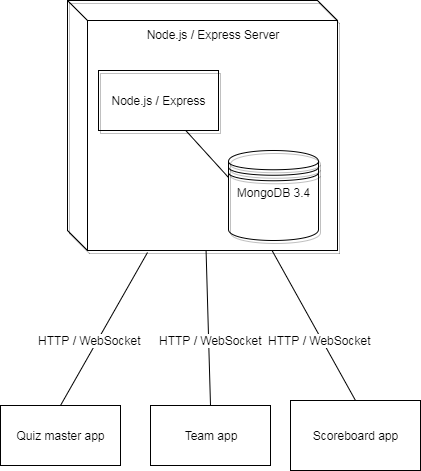

# Table of contents
* [Architecture overview](#architecture-overview)
* [MongoDB Schemas](#mongodb-schemas)
  * [Category](#category)
  * [QuizQuestion](#quizquestion)
  * [QuizNight](#quiznight)
  * [QuizRound](#quizround)
* [API Message format](#api-message-format)
  * [HTTP REST](#http-rest)
    * [Quiz master starts a new quiz](#quiz-master-starts-a-new-quiz)
    * [Quiz master starts quiz with final team setup](#quiz-master-starts-quiz-with-final-team-setup)
    * [Quiz master starts new round](#quiz-master-starts-new-round)
    * [Quiz master starts new question](#quiz-master-starts-new-question)
    * [Quiz master closes question](#quiz-master-closes-question)
    * [Quiz master evaluates question](#quiz-master-evaluates-question)
    * [Quiz master ends quiz](#quiz-master-ends-quiz)
  * [WebSocket subprotocol](#websocket-subprotocol)
    * [Message format client to server](#message-format-client-to-server)
    * [Message format from server to client](#message-format-from-server-to-client)
    * [Team applies for quiz](#team-applies-for-quiz)
    * [Team submits answer](#team-submits-answer)
    * [Quiz master evaluates answers](#quiz-master-evaluates-answers)
  * [Design decisions](#design-decisions)
    * [Answering questions through WebSocket](#answering-questions-through-websocket)
    * [Evaluating questions through WebSocket](#evaluating-questions-through-websocket)
    * [Categories in its own collection and no _id field](#categories-in-its-own-collection-and-no-_id-field)
* [UI Design](#ui-design)
  * [Quiz master app](#quiz-master-app)
  * [Team app](#team-app)
  * [Scoreboard app](#scoreboard-app)
* [List of frameworks/libraries](#what-frameworkslibraries-will-be-used)
# Introduction
The quizzer is a web application designed to facilitate quizzes with teams and a quiz master.
For the teams there will be an application to participate in the quiz by applying and answering questions. 
The quiz master will have an application to accept or refuse team applications, manage rounds and select questions from categories.
Finally there will be a scoreboard application so that everyone can see the game status.

# Architecture overview
The three smaller client applications will all communicate with a single server. 
This server is able to manage the actions of the various actors and the flow of the quiz.
To manage these actions, HTTP and WebSocket will be used. 
The server may store or retrieve data for these actions in a MongoDB database located on the same server.
The client applications will run in browsers and are not native applications



# MongoDB Schemas
This chapter will outline the structure that the data is going to have.
#### Category
The category collection contains all possible categories for questions to have.
```javascript
{
    _id: String
}
```
#### QuizQuestion
The QuizQuestion collection contains all possible questions with their categories
```javascript
{
    _id: ObjectId
    question: String
    category: String
}
``` 
#### QuizNight
The QuizNight collection contains information about the state of a quiz.
The teams name must be unique within the teams array.
Password must also be unique

```javascript
{
    _id: ObjectId
    password: String
    quizMaster: String
    isActive: Boolean
    teams: [
        { 
            name: String, 
            totalRoundPoints: Number, 
            roundResults: [
                {
                    roundNumber: Number, 
                    correctAnswers: Number
                }
            ] 
        }
    ]
}
``` 
#### QuizRound
The QuizRound collection stores detailed information about quiz rounds of a given quiz.
Records will be uniquely identified with an index on the combination quizId and roundNumber.
```javascript
{
    quizId: ObjectId
    roundNumber: Number 
    questionData: [
        {  
            question: {
                id: ObjectId,
                question: String,
                category: String
            },
            teamAnswers: [
                {
                    teamName: String,
                    answer: String,
                    approval: String
                }
            ] 
        }
    ]
}
``` 
# API Message format
The applications will make use of a REST API for simple actions 
and a websocket subprotocol for actions that require websocket functionality.

## HTTP REST
### Quiz master starts a new quiz
The quiz master needs to provide his/her own name and a password for applicants.

HTTP POST /quizzes
````javascript
{
    name: "quizzMaster123",
    password: "secret"
}
````
Effects: 
* A new QuizNight object will be created in the database. 

### Quiz master starts quiz with final team setup
HTTP POST /quizzes/:quizId/teams
````javascript
[
    "team1", "team2", "team3"    
]
````
Effects: 
* Adds team information to the QuizNight object in the database.
    
### Quiz master starts new round
HTTP POST /quizzes/:quizId/:roundNumber

Empty request body, the parameters are implying to create a new round

Effects: 
* Create an empty round object in the database with the given quizId and roundNumber

### Quiz master starts new question
HTTP POST /quizzes/:quizId/:roundNumber/questions
````javascript
{
    _id: ObjectId
    question: "When was the end of the second world war?",
    category: "History"
}
````

Effects: 
* Add an object to the questionData array with the supplied question.

### Quiz master closes question
HTTP POST /quizzes/:quizId/:roundNumber/:questionId/answers
````javascript
[
    {
        teamName: "team1",
        answer: "1942",
        approval: "Unknown"
    },
    {
        teamName: "team2",
        answer: "1945",
        approval: "Unknown"
    }
]
````
Happens when quiz master closes the question.
Effects: 
* Adds to questionData with the team answers. Answers are now waiting to be approved

### Quiz master evaluates question
HTTP PUT /quizzes/:quizId/:roundNumber/:questionId/answers
````javascript
[
    {
        teamName: "team1",
        approval: "Rejected"
    },
    {
        teamName: "team2",
        approval: "Approved"
    }
]
````

Effects: 
* Updates the status of the answers to the question.
* Updates the correctAnswers for the teams for this round in QuizNight.

### Quiz master ends quiz
When the quiz master ends the quiz, he/she gets asked if the quiz results have to be remembered.
If so, the following happens: 

HTTP PUT /quizzes/:quizId

Effects: 
* Sets QuizNight object's isActive field to false in database.

If the quiz results do not need to be remembered, then this happens:

HTTP DELETE /quizzes/:quizId

Effects
* Deletes a QuizNight and all its QuizRounds

## WebSocket subprotocol
This chapter will outline the subprotocol used for the parts of the application where WebSocket is used.
Messages will be characterised by their type. All messages should have this and the messageType denotes what the message is about.
Responses will contain information about whether the action succeeded or failed with a supplied reason.
### Message format client to server
All messages should contain a messageType and additional fields for data belonging to the action

````javascript
{
    messageType: "ACTION"
    //additional fields for data
}
````

### Message format from server to client
Responses for a given action have a messageType, status and reason
````javascript
{
    messageType: "ACTION"
    status: "..."
    reason: "..."
}
````

### Team applies for quiz
The team app sends a WebSocket message to apply:

````javascript
{
    messageType: "APPLY",
    teamName: "The A-Team",
    password: "secret"
}
````

Effects: 
* The server goes through the active quiz nights and checks for a password match.
* If no matches are found, then return: 

    ````javascript
    {
      messageType: "APPLY_FAILED_NOMATCH"
      message: "There were no quizzes with the password 'secret'"
    }
    ````
    
*  Otherwise, if accepted return: 
  
    ````javascript
    {
    messageType: "APPLY_SUCCESS"
    message: "You are now 'The A-Team' in the quiz with quiz master 'quizzMaster123'"
    }
    ````

*  if not accepted, return: 
  
      ````javascript
      {
        messageType: "APPLY_FAILED_REJECTED"
        message: "You were rejected from entering the quiz by the quiz master"
      }
      ````

### Team submits answer
Submitting answers will be done through WebSocket.
````javascript
{
    messageType: "SUBMIT"
    teamName: "team1"
    questionId: 1
    answer: "1945"
}
````

Effects: 
* The answer for this team will be stored in the session or in the socket object.
* Scoreboard updated that this team has submitted answer
 
### Quiz master evaluates answers
When the quiz master approves or disproves answers to questions, it will be temporarily stored in the session or in the socket object.
When a status changes, the clients get notified and the scoreboard app updates.
When the quiz master is happy with the evaluation and starts the next question, only then will the approvals be stored in the database.

Evaluation message format is as follows: 
````javascript
{
    messageType: "EVALUATE"
    teamName: "team1"
    approval: "Rejected"
}
````

Effects: 
* Quiz master UI updates indicating this result is rejected
* Server notifies scoreboard app

# Design decisions
### Answering questions through WebSocket
When a team submits an answer, it is not directly stored in the database. 
This is because the answer is not yet final, and it may change.
To prevent multiple trips to the database, this information is temporarily stored in the socket/session object on the server.
When the quiz master closes the question, the final answers get stored in the database.

### Evaluating questions through WebSocket
When the quiz master needs to evaluate answers, the status of that approval must be shown immediately on the scoreboard.
The quiz master can also change his/her evaluation before moving on to the next question
To prevent hitting the database multiple times here with this temporary data, the database will only get hit when the quiz master submits hit final decisions.  
Instead the temporary evaluation will be stored in the socket object/session.
This means that the effect of approving (round points, correct answers per round) will have to be based on the session/socket data as well.

### Categories in its own collection and no _id field
To be easily able to access the category of a question, they are stored together in the QuizQuestion collection.
However, the categories are stored separately as well, because we want to be able to list all categories easily.
The category name must be unique, so we do not need an _id field and we can reference the value directly.

# UI design
The UI will have a blue background with black buttons and white text. 
This will be kept consistent through all three applications to create cohesion.

## Quiz master app
This chapter will outline the various screens for the quiz master app. 
### Start screen
The quiz master name does not have to be unique, but the password must not be in use already by another quiz.

### Lobby
From this screen the quiz master can manage teams before the quiz starts. If the quiz master attempts to start a quiz when there are still open applicants,
then a warning prompt will appear. The quiz master can change his/her mind when a team is already accepted by kicking the team out of the room.
The accept all / refuse all buttons apply the state to all the currently open entries in the list.


### Start round

### Select question

### Close question

### Evaluate answers


## Team app

### Applying for a quiz


### Submitting answers


## Scoreboard app

### Start screen / no data


### Question in progress


### Question closed


# What frameworks/libraries will be used?
MongoDB (Mongoose), Express, React, NodeJS will be used as they are mandatory for this assignment.
This chapter will specify what technologies are put on top of this stack to make life easier.

## Redux, react-redux
Redux will be used for the SPAs in React to manage state in a different way. This will be used for learning purposes.

## Superagent / Supertest
Superagent will be used because it provides an easier API to manage ajax requests.
Supertest will be used to test the REST interface. These are both used because of familiarity and to improve productivity.

## Mocha
Mocha will be used for the tests

## React-bootstrap (Bootstrap in React)
React-bootstrap will be used because it makes styling and positioning react components easier. 

## express-validation
This is an express middleware that validates the incoming request according to a schema.
This framework will also give messages for when requests are not obeying the schema, so callers to methods will be informed about missing properties etc. 
The code inside the REST methods can then safely assume that the request is well structured. 

## Joi
Used for validating js objects. This is useful for asserting properties in unit tests. You can write schemas and then validate objects against it.